# Tech Stack
## Backend:
1. PHP - 7.4.3
1. Laravel - v6.0.4
1. ImageMagick - v2.5
1. Tesseract OCR - v2.9
1. AWS - EC2
1. CloudFlare - Proxy

## Frontend
1. HTML
1. Tailwind CSS v1.5.1
1. jQuery v3.2

 

# Code Structure

## Build
* Dev Container -> [.devcontainer/devcontainer.json](../../.devcontainer/devcontainer.json)
* Docker Compose Dev -> [docker-compose.dev.yml](../../docker-compose.dev.yml)
* Docker Compose Prod -> [docker-compose.yml](../../docker-compose.yml)
* Config files for Prod -> [build/prod](../../build/prod/)
* Linter config -> [.phpcs.xml](../../.phpcs.xml)
* Setup files (DB) -> setup/{APP_ENV}/db
* Environment file -> .env
## Backend
* Composer file -> [composer.json](../../composer.json)
* Middleware -> [app/Http/Middleware](../../app/Http/Middleware)
* Controllers -> [app/Http/Controllers](../../app/Http/Controllers)
* Models -> [app/](../../app/)
* Database
    * Migrations -> [database/migrations](../../database/migrations)
    * Factories -> [database/factories](../../database/factories)
    * Seeds -> [database/seeds](../../database/seeds)
* Routes
    * Web -> [routes/web.php](../../routes/web.php)
    * API -> [routes/api.php](../../routes/api.php)
## Frontend
* Public Assets -> [public](../../public/)
* Stored Files -> [storage](../../storage/)
* CSS Scripts -> [public/css](../../public/css)
* Views -> [resources/views](../../resources/views)

